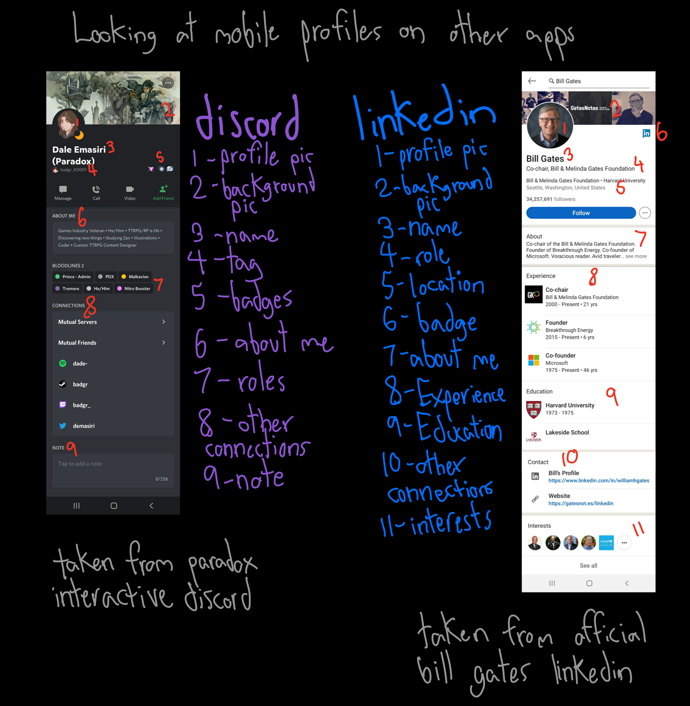
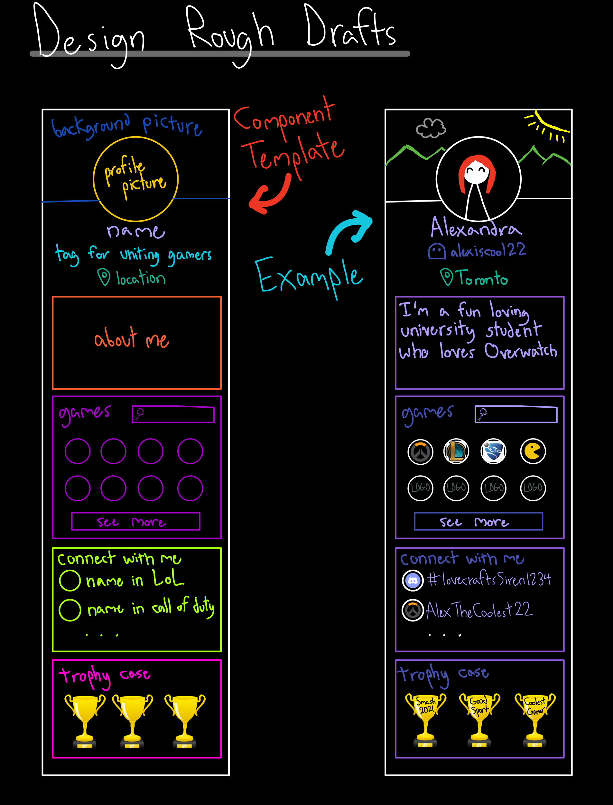
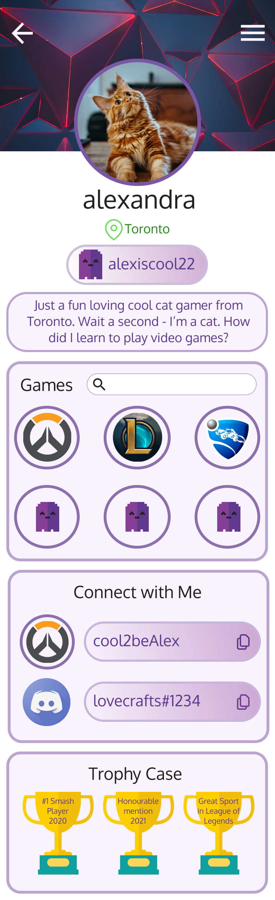
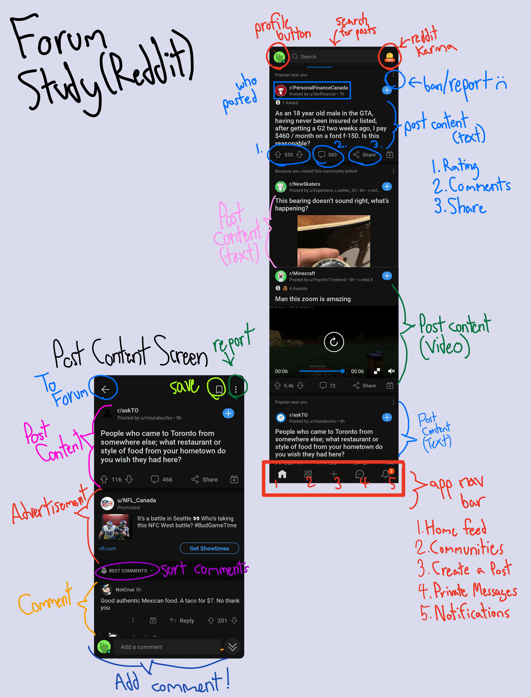
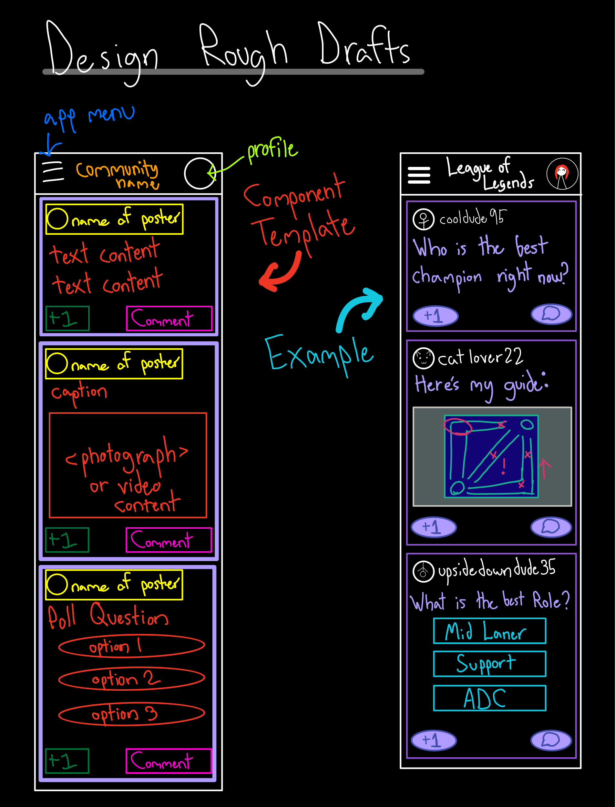

# Error 404: Team Name Not Found
> _Note:_ This document is meant to evolve throughout the planning phase of your project.   That is, it makes sense for you commit regularly to this file while working on the project (especially edits/additions/deletions to the _Highlights_ section). Most importantly, it is a reflection of all the planning you work you've done in the first iteration.
 > **This document will serve as a master plan between your team, your partner and your TA.**

## Product Details

#### Q1: What are you planning to build?

We are aiming to build a Linkedin-esque social network for gaming in the form of a mobile app, this product will be a gamer/player based interface for gamers to connect with each other, with a focus on recreational gaming.

Currently United Gamers has an MVP for a league management tool for esports, the product we are designing is to be a player focused social network. Currently there is no known(to us or UG) gaming focused social network, this product aims to fix that problem.

It will have 3 main features:

- Forums for gamers to communicate on, a direct messaging system might also be viable. This will allow gamers to connect with each other, coordinate a game, etc.

- Players will have their own profiles which shows their info (
games, stats, etc). This will allow other players to see which games someone is playing, where they are located etc.

- Badge/Trophy system, award player badges which can be displayed on their profile as well as show gaming rankings. Players can hand out these badges to other players for attributes such as good sportsmanship etc. They will be similar to Linkedin recomendations. The rules regarding this still need to be discussed.

#### Q2: Who are your target users?

Target users:
- Ages ranging from ~14-35
- Casual gamers
- Multiplayer gamers

###### Persona: Joseph Marq
Joseph is a 19-year-old male college student in economics who loves playing video games whenever he makes time in his busy schedule. One of his favourite games to play is Overwatch, but he finds that he has trouble winning games when he doesn’t play with his friends. Joseph is in the average competitive rank of the game, but he never cared too much for competition. To Joseph, playing Overwatch with his friends was great, no matter if they win or lose. In order to help pay off his tuition, Joseph has a part-time job as a waiter at a restaurant near his college. He is quite mellow, but not in an antisocial way.

Joseph lives on his college campus, where he eats almost exclusively from the cafeteria since he does not know how to cook anything beyond pasta. He plays on the soccer intramurals held at his school with several of his friends. Interaction with others is a large source of motivation for Joseph, as he thrives off a sense of community and competition related discussions. He also has a little sister (~12 years old) which he strives to serve as a good role model for. He wants to introduce his sister to video games, but knows that he must be careful on what websites to direct her to as some online platforms suffer from a large amount of toxicity.

Even though Joseph does not think of Overwatch as a competitive game, he still watches the E-Sports league tournament games on twitch whenever he can. Joseph also likes it when things are done fast, which is why he prefers YouTube tutorials over textbooks for learning any course content. Joseph enjoys playing games with his friends, but wishes there was a more tight knit community at his college, akin to a soccer club but for video games.

#### Q3: Why would your users choose your product? What are they using today to solve their problem/need?

- There is currently no single platform for gamers to showcase their interests and skills across multiple games.
- Platforms such as Discord or Reddit are great for gamers to meet each other, but it contains a barricade for them to conveniently share personal achievements and interests. Our platform would have a “trophy case”, where a user’s favourite games and rank in each game (if they wish to share it) amongst other gaming related information is displayed and viewable to other users.
- Video game streaming platforms (such as Twitch) do not allow for users to connect on equal footing. Typically, streams consist of one popular streamer broadcasting to many viewers, creating a barrier for incoming gamers (aka viewers) to have any significant interactions amongst each other.
- Take our persona from question 2 as an example: Joseph enjoys the community that has formed around his soccer playing habits, but has trouble finding the same sense of community in the world of gaming. The cause of this difficulty is that it is much easier to form a close-knit community from in-person interactions. This type of interaction is missing from online platforms as they mainly focus on a game, rather than on the players who play many games. The app we seek to develop will allow individuals like Joseph to connect with other gamers in settings seen in traditional sports.  
- This is a platform that seeks to unite all casual and competitive players on one platform through positive connections. For instance, features are planned to be implemented so that only positive comments will be tolerated on the forums, which embodies the Uniting Gamers philosophy of “uniting all gamers”.

#### Q4: How will you build it?

As the engineers, we've been given full reign on development tools. Our technology stack currently looks like React Native, JavaScript, TypeScript, Redux, react-native-normalised, React-native-extended-stylesheet, React Navigation, Axios, react-native-paper, and react-native-offline on the client side. Jest will be the testing library for both the client and server side. The server side stack will be Python, Django, MongoDB, Redux, AWS, and Passport.js. At the moment, the third-party applications and APIs we’re planning on using are the Stripe payments API, AWS Amplify, AWS RDS, Expo, GitHub, Postman, and one of Mockoon, mockAPI, Beeceptor, or Mocky. Our application would be deployed on the play store and app store through Expo. Locally, we would also be using Expo. Our testing strategy will involve using Github actions for CI/CD that will be the architecture using the Expo CLI which will ensure testing on PR’s and testing, staging and deployment on verified changes. Furthermore, we’ll have development and production environments that will also include automated deployments on merges and successful testing, building, and deploying after a push. Unit, service, and integration tests will be done using Jest. We will be using the regular test automation strategy to ensure specific features work as intended after implementation. From a high-level perspective, our possible components will be Login, Home, Profile, Stats, Trophies, Forums, and Navigation. We’ll be using a very common design pattern called MVC (Model, View, Controller).

#### Q5: What are the user stories that make up the MVP?

- As a user of the app (gamer), I can create a profile using my email and a password to start using the app
- As a user I can update my profile with personal info to show other gamers
- As a user I can add my location to my profile to connect gamers close by/ in similar time zones
- As a user I can display the games I play on my profile to show other gamers
- As a user I can display stats on my profile to show other gamers
- Trophies and badges will be automatically added to a user’s profile to show other gamers
- As a user I can set access levels for my profile to control who sees my info
- As a user I can create a forum to discuss a specific topic/game/etc.
- As a creator of a forum I can assign moderators to moderate
- Activity badges will be tagged to a user in a forum to show how active they are
- Trending topics in a forum will be displayed to inform other forum members
- A user can navigate to another person’s profile from their comment or post to see their info
- Social badges can be awarded between users to encourage a positive environment

----
## Intellectual Property Confidentiality Agreement

Please note this document is not a formal legal document but rather a set of expectations and guidelines.

>A. The software will have a license and is not to be shared freely without said license. 
>B. After the project is done, student developers can upload the project to GitHub or any similar domains. 
>C. The software MVP will be released to the partner under a license that is previously agreed upon. 

----

## Process Details

#### Q6: What are the roles & responsibilities on the team?

| Roles | Responsibilities |
| ----- | ---------------- |
| Backend Engineer| Builds and maintains a software application especially on the server side. They focus on web services and data storage, as well as having a role in the business and implementation logic. Also, they must prepare all the information that needs to be sent over to the frontend side of the application. |
| Frontend Engineer | The frontend engineers work closely with the designers to make the applications they are designing close to/exactly like what the designer imagines. They will need to have knowledge on frontend languages and frameworks such as HTML, CSS, JavaScript, React, etc. With this knowledge, the frontend engineers will design the website on the client facing server and make sure it is appealing to the users without showing any bugs physically on the app. |
| UI/UX Designer | The UI/UX designer creates a user-friendly interface that enables users to understand how an application will work. They also prototype an application/product, which is an experimental process where they implement ideas given to them by the customer and create tangible forms of that idea. |
| DevOps (Auto-testing) | An auto tester is someone who uses a process to validate if software is functioning correctly and meets user requirements before going out into production. CI/CD (continuous integration/continuous deployment) is very common in this process. CI/CD will enforce automation in building, testing and deployment of applications. |
| Scrum Master | The scrum master helps to facilitate scrum to the team by ensuring a scrum is followed. They lead the team in scrum, a framework for developing, delivering and sustaining products with deadlines. |
| Product Owner | The Product Owner is a collaborator of the Agile Team who is responsible for tasks such as defining user stories and prioritizing the Team Backlog to efficiently ensure that the execution of the program is on time while maintaining the integrity of what the app should entail. |
| Code Reviewers | During or after the implementation of software, the code review is a software quality assurance activity where the code reviewers check a program by viewing and reading parts of the source code in the application they are developing. |

##### Error 404 Software Development Team
<ins>Alexandra Thompson</ins>
- **Roles:**
   - Frontend Engineer
   - Product Owner
   - UI/UX Designer

- **Strengths:**
   - Knowledgeable on many languages such as Python, Java, C, C++, HTML, JS, CSS
   - Able to utilise many complex python libraries such as numPy, Matplot, etc
   - Can efficiently develop with MVC design pattern as well as other common code architectures

- **Weaknesses:**
   - Unfamiliar with Django
   - Not experienced with Swift
   - Not good with Kotlin

<ins>Arjun Sahni</ins>
- **Roles:**
   - Backend Engineer
   - Scrum Master

- **Strengths:**
   - Knowledgeable on languages such as Python, Java, etc.
   - Great with the framework Flask
   - Able to perform with dev methods such as Agile, Scrum, etc.

- **Weaknesses:**
   - Not great with JavaScript
   - Limited ability to perform with typescript frontend
   - Not knowledgeable on Angular

<ins>Hamzah Shahid</ins>
- **Roles:**
   - Backend Engineer
   - Code Reviewer

- **Strengths:**
   - Can efficiently recognize algorithmic problems patterns (Ex. Sliding Window, Two-Pointer, etc)
   - Able to utilise Node.js as well as REST APIs
   - Can easily code in Python

- **Weaknesses:**
   - Struggle with React Frontends
   - Unable to perform well with dynamic programming
   - Difficult to program using the language C

<ins>Herjot Dhaliwal</ins>
- **Roles:**
   - Backend Engineer
   - Code Reviewer

- **Strengths:**
   - Can efficiently develop apps on React
   - Knowledgeable on Agile Development
   - Experienced in Azure

- **Weaknesses:**
   - Cannot perform well on frontend of applications
   - Not very knowledgeable on mobile development
   - Inefficient using angular

<ins>Jaakulan Subeethakumar</ins>
- **Roles:**
   - Backend Engineer
   - Frontend Engineer

- **Strengths:**
   - Can easily create beautiful applications using frontend technologies
   - Able to efficiently connect backend information to frontend as well as display it
   - Very knowledgeable on full-stack applications

- **Weaknesses:**
   - Difficulty using an functions that need asynch and await
   - Unable to catch errors and utilise them well from “Try and Catch” functions
   - No experience with Flutter software

<ins>Nada El-Falou</ins>
- **Roles:**
   - Frontend Engineer
   - DevOps

- **Strengths:**
   - Knowledgeable on many languages such as Python, Java, C, C++, HTML, JS, CSS
   - Able to utilise many complex python libraries such as numPy, Matplot, etc
   - Can efficiently develop with MVC design pattern as well as other common code architectures, including parallel architectures

- **Weaknesses:**
   - Little to no knowledge on databases
   - Limited experience with frameworks
   - Limited experience with deployment.

<ins>Thomas Tsangaris</ins>
- **Roles:**
   - Backend Engineer
   - Product Owner

- **Strengths:**
   - Fluent in Python, Java and C with some side projects in those languages
   - Very comfortable with scientific programming (ex. making plots with matplotlib, vectorizing code with numpy, etc.)
   - Refined communication and documentation skills from working on a computational research project

- **Weaknesses:**
   - No experience coding in frontend
   - No experience with databases
   - Limited experience with advanced git techniques

#### Q7: What operational events will you have as a team?

##### Planned meetings:  
<ins>**Uniting Gamers Representative Meeting:**</ins> 
	***When:* According to the representative's schedule (usually during the daytime). However the tentative time is weekly every Wednesday during 3:00pm-4:00pm EST**  
	__Where: Zoom__  
	__Purpose:__ To help the development team and the project team to be on the same page in terms of development. Also to ensure the software application is following the aspirations that Uniting Gamers..  

<ins>**Standup Meeting:** </ins> 
	***When:* Bi-weekly after 5:00pm EST, the group members will mention when they are available using the team discord server.**  
	__Where: Team’s Discord Server__  
	__Purpose:__ To help everyone on the team be up to date on all the new changes that the code has gone through as well as to bring up all the problems that a team member may experience. Some of the questions that may be asked and answered by each team member are:  
	1. What did you do yesterday?  
	2. What will you do today?  
	3. What blocks stand in your way?  

<ins>**Planning Meeting:**</ins>  
	***When:* Weekly after 4:00pm EST, the group members will mention when they are available using the team discord server. (Most likely Wednesday during 4:00pm-5:30pm EST)**  
	__Where: Team’s Discord Server__  
	__Purpose:__ To aide in the process of scrum. The meeting helps to determine which backlog items (user stories) will be handled in the next sprint. Each of the team members will take one of the items to develop, unless they have not completed their previous item from the last sprint and need more time.  

<ins>**Review Meeting:** </ins> 
	***When:* Whenever the product owner's schedule is free during the week. This meeting will happen once a week.**  
	__Where: Team’s Discord Server__   
	__Purpose:__ To aide in the process of scrum. The meeting helps to determine how fast/slow the progression for the week was. This allows the team to inspect the outcome of the Sprint and determine what adaptations need to be made in order to meet deadlines while not sacrificing the functionality of the app. Only the product owners need to attend this meeting, and everyone else is welcome to join if they want. 

<ins>**Emergency Team Meetings:**</ins>  
	***When:* On Demand, Saturday during 9:30am-11:00am**  
	__Where: Team’s Discord Server__  
	__Purpose:__ If there is a deadline that cannot wait for the regular weekly group team meeting, the team will use an emergency team meeting that will act the same as a regular group team meeting. However, 1 or 2 members may miss it and be updated on the meeting later on by another team member. This is done as an emergency meeting out of nowhere may not fit in everyone’s schedule.  

##### First two meetings with Uniting Gamers
<ins>First Meeting</ins>
> Duration : 1 hour and 16 mins

*What did you discuss during the meeting?* 
 - We introduced the Error 404 team members and met Josh, one of the founders of the Uniting Gamers.  
 - We learned about the history of Uniting Gamers and what they have accomplished throughout the four years they have been running. Some of these accomplishments include running gaming events and tournaments.  
 - The mission statement for this project was to help Ontario E-Sports grow larger and to efficiently manage many players by including them into a virtual community with the app that they need help creating.  
 - The idea of the virtual community with the app came from when the pandemic struck and in-person events were impossible to do.     

*What were the outcomes of the meeting?*  
 - We discussed a regular meeting time between the Error 404 team and the Uniting Gamers organization, which was weekly every Wednesday 3:00pm-4:00pm  
 - Discussed what the application should entail, no specific details yet, more of an introduction, where the application was described as a “MySpace for gamers”     

<ins>Second Meeting</ins>
> Duration : 1 hour and 7 mins

*What did you discuss during the meeting?*  
 - We met with one of the lead developers from Uniting Gamers (Hayden) and we did a quick introduction between the Error 404 team and him.
 - We learned more about the specifics of the application that Uniting Gamers were thinking of (more below).
 - We also received the problems that needed to be solved through the implementation of this app as well as some extras. These problems and extras were:
 	- Gamers have a hard time showcasing themselves.  
 	- Gamer tag on profile creating a social aspect to games + profiles.  
 	- Forums with the profiles (similar to LinkedIn).  
 	- Fighting toxicity in gaming + teaching online etiquette by:
 		- Badge + trophy for having good sportsmanship (like the one in League of Legends)  
 		- Rate players profiles    

*What were the outcomes of the meeting?* 
 - We learned that the application must be mobile and usable on both iOS as well as Android. This helped us realise that Flutter and React Native may be a good idea to develop the front end of this mobile app. 
 - This is an individual standalone app, where we were given complete control of how the design should look as well as how the app should behave. 
 - The Uniting Gamers team also told us that they will send us their disclosure agreement and suggested that we should be allowed to show this off on our resume. More on this in the license and agreements section.    

#### Q8: What artifacts will you use to self-organize?

We decided to use Discord for easy and quick general communication. We use it to hold meetings over voice channels, for general announcements/discussions and team discussions (every subteam, e.g. backend team, has their own channel in addition to the main team channels). We also use a discord bot, "Apollo", to schedule events, meetings, deadlines and reminders. We also have separate channels to communicate with our partner organisation "Uniting Gamers", quick inquiries with teammates and weekly meeting plans. All other channels are private between us students so we do not spam our partner organisation.

We will also use Jira for scrum tasks. Jira allows us to create the tasks, prioritize them, assign them to people and indicate their progress (not done/in-progress/done/deployed). Our scrum master, Arjun, will be the main controller of the server as he organises what needs to be done and assigns tasks to other team members.

Finally, we use Google Drive, Sheets and Docs for general shared documents. The shared Google Drive link is pinned in the Discord server for easy access. It leads to a folder containing meeting minutes/notes documents, general deliverable plans and other documents needed to be shared with all team members.

#### Q9: What are the rules regarding how your team works?

Describe your team's working culture.

**Communications:**
- General discussions happen everyday on the #general channel in Discord, and the expectation is to check it is approximately every 1-2 days. If there are any urgent announcements or needed action, we ping/tag each other for quicker response. Off topic and social discussions have their own channels as to not spam the important information channels.
- We will set up a meeting with the partner organisation on a week-by-week basis, typically discussing meeting times in the beginning of the week through the Discord chat channel specifically for communicating with Uniting Gamers. The meeting time will be set according to our product owners’ and partners’ time availability, but any other team members who can attend should. If we have any general inquiries that were not discussed in the meeting and are urgent/can’t wait till the next meeting, we will message our partners’ without necessarily setting a meeting time. However, the team member who is posing the question must ask the team first, especially the product owners, to prevent redundancies.

**Meetings:**
- As mentioned above, meetings with our partner organisation are only mandatory for our product owners. Our team meetings, however, are mandatory for all. Anyone who cannot attend for urgent reasons must inform the team and alert the product owners, and read the meeting minutes afterwards. There are no set penalties, the Team Police Officer (a very serious role of course), Nada, doesn’t really believe in them, but recurring shortcomings may result in bad peer evaluations.

**Conflict Resolution:**
- If any members feel shortcomings of others, they must alert them constructively. We all commit to accepting constructive criticism from each other to hold each other accountable. Otherwise, we are as weak as our weakest link.
- Examples of conflict and how we would handle them:
	- If there are indecisions within the team, we will vote. Votes include an “either” option to allow better decision making according to preferences and not only random choices (it works since we’re an odd number of people).
	- In the case when a team member is non-responsive, we will give them 1-2 days to respond (in case they had a special emergency). If there is a deadline coming up, we will cover for them temporarily and assign their tasks to others. When they return, we will redistribute the work fairly. If they remain unresponsive for a week, we will contact the TA.
	- If there is a lack of trust happening in the team, we’ll address it in two ways: the first is by discussing why it is the case (like if someone mistrusts a person who missed a deadline in the past) and try to resolve it from there. The second is by having trust-building activities in a trampoline park.

----
## Highlights

**Design and build a mobile app for IOS and Android from scratch**

Based on the initial document given to us about the Uniting Gamers organization it was unclear whether we would be developing a web app, mobile app or both. After our meeting with Uniting Gamers, they made it clear that developing a mobile app would be best for what they have in mind. We were told that a mobile application would be ideal because when Uniting Gamers would host esports tournaments and other events roughly 80% of the people participating in these tournaments and events would check their stats on their phones. This is why a mobile application would best suit the Uniting Gamers clients. Furthermore, there is existing software already in place but after speaking with Uniting Gamers it was clear that we should develop a product from scratch instead of using their software. This way we would not have to deal with legacy code and no ramp ups would be needed. In general, ramp ups can take up to a month or even longer which would be time consuming and not ideal. However, with developing from scratch everyone can get started in a week or two on their respective parts. In addition, our project is essentially a subsidiary of Uniting Gamers. Due to the pandemic, Uniting Gamers had to outsource their platform to other organizations. Furthermore, this product is much different from what they have already. Currently they have software for managing esports tournaments and events, but what we are building is similar to a linkedin but designed for gamers. The intention behind this is to promote a virtual community amongst gamers and fight against the toxic stigma gamers have for one another.

**Deciding on Roles within the team**

Deciding on who did what was an important decision we as a team had to make. To understand each person's interests, we had everyone write down their individual strengths and weaknesses, including their preference. Later we held a meeting to go over the various roles brainstormed by each member. This led to discussions about what roles we all thought were important and suitable for everyone based on their strengths and weaknesses for a project of this caliber. Luckily this was not a difficult process as everyone was content with the roles given. Each member was given their desired roles. In the end, we decided on having seven roles within the team, Backend engineers (Arjun, Hamzah, Herjot, Jaakulan, and Thomas), Frontend engineers (Alexandra, Jaakulan, and Nada), UI/UX designers (Alexandra), DevOps (Nada), Scrum Master (Arjun), Product Owner(Alexandra, and Thomas), and Code Reviewers (Hamzah and Herjot). This was done to ensure a clear difference between the two. This decision allowed both the frontend and backend to have a separate representative. This also assures a person to not feel overwhelmed as a product owner. Furthermore, we decided to have a scrum master as scrum methodologies are proven to offer better product quality. Scrum development guarantees ongoing revisions, constructive feedback, and constant testing, as opposed to a waterfall-style methodology where the product is only assessed at the end. Scrum will also allow for a customer-focused approach as the waterfall methodology simply does not allow for such an approach.

**Choosing the tech stack**

For the tech stack, we were given complete freedom in choosing what we will use for building our project. Uniting Gamers want us to use tools/technologies we are comfortable with. For the frontend we chose to use react native alongside javascript/typescript. We chose react native since it is similar to react and most of us have experience working with react and javascript/typescript. It also offers a cross platform solution so we will not need to make two seperate apps (one for IOS and the other for Android). There are other frameworks such as Flutter that also offer a cross platform solution, however, react native has many more libraries and has more support compared to flutter. Another disadvantge to flutte is that we would have to learn Dart which is a programming language no one on our team is familiar with. For the backend we chose Django as our framework of choice mainly because it would allow us to use python which is a language everyone on our team is comfortable working with. Other alternatives we considered are express js and flask. While django is more complex than express and flask it is highly efficient making it quite cost effective. Furthermore, it has a nice architecture known as the MTV (Model Template View) which is great for managing and validating data. In addition, Django is much more powerful and more mature than Flask. In terms of our databse we will likely choose a NoSQL database such as MongoDb or CosmosDb but this is subject to change based on what type of data we will need to store.

----
## Mockup
The design process starts with best understanding what the customers of this future application want. The goal of this Uniting Gamers application is to better connect fellow gamers. After our first meeting with Uniting Gamers representative, Josh, **we agreed that our features of the MVP need to be:**

 - Connecting players through sharing profiles with each other.
 - Connecting players through forum chatting.

We discussed the first initial focus of our application would be to touch on creating great gamer profiles to share with each other. We expressed that viewing their stats to games, their gamer tags, profile pictures and other features like this would make it easier for gamers to connect with each other.

Before we looked at creating the application mockups, **we decided to analyze player profile features from other applications** in order to gain a good understand of what we like and don't like in a user profile.

Here is an analysis of LinkedIn and Discord user profiles.

 &nbsp;

After doing this analysis, **we drafted up our first sketches on the user profiles** here through a pen and paper approach (in this case, iPad and Apple pencil, but it's the same idea).

Here is the low fidelity wireframe and user-information prototype of the user profiles.

 &nbsp;

Now that we are satisfied with a wireframe and a mockup, **we decided to create a high-fidelity Figma prototype of the User Profile**.

 &nbsp;

And here is the Figma link for the hi-fi prototypes. You can press the play button to see it as the app would look in a phone: https://www.figma.com/file/y02hdstMkdAA6s0CaO04Hl/Uniting-Gamers-Hi-Fi-Prototype?node-id=7%3A11

After finishing our initial drafts of the user profile, **we decided to analyze mobile forums from other applications** in order to gain a good understand of what we like and don't like in a forum.

Here is an analysis of mobile forum pages from Reddit:

 &nbsp;

Lastly, **we drafted up our sketches on the forum portion of our MVP**.

Here is the low fidelity wireframe and user-information prototype of the forum:

 &nbsp;

We decided not to create a high fidelity prototype based on this sketch alone, as we decided it was subject to a great amount of change.
